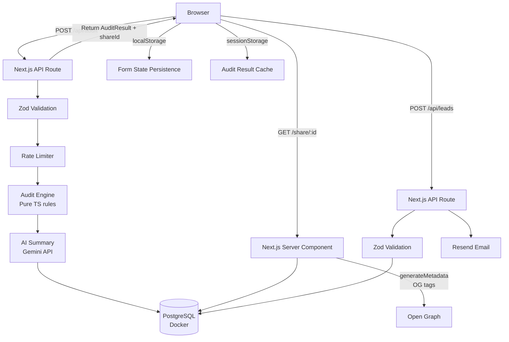

# ARCHITECTURE.md

## System Diagram



## Data Flow: Input → Audit Result

```
User fills form
    │
    ▼
AuditForm.tsx validates & submits
    │  POST /api/audit { tools[], teamSize, useCase, honeypot }
    ▼
API Route: rate check → Zod parse → honeypot check
    │
    ▼
runAuditEngine(input) → AuditResult
    Rule set per tool:
    1. Seats > teamSize × 1.25? → reduce_seats
    2. Plan too heavy for seats? → downgrade_plan (tool-specific rules)
    3. Cheaper alternative fits use case with >20% savings? → switch_tool
    4. High absolute spend? → buy_via_credits
    5. None of above → already_optimal
    │
    ▼
generateAiSummary(input, result) → string
    Calls gemini-1.5-pro with structured prompt
    Falls back to templated summary on any API error
    │
    ▼
INSERT into audits table (share_id = nanoid(10))
    │
    ▼
Return { ...AuditResult, shareId }
    │
    ▼
Client: sessionStorage.setItem('auditResult', ...)
router.push('/audit/results')
    │
    ▼
Results page reads sessionStorage, renders AuditResultsView
    │
    ▼ (optional)
User enters email → POST /api/leads
    → INSERT leads table
    → Send Resend email with share URL
```

## Stack Choice

| Layer | Choice | Reason |
|-------|--------|--------|
| Framework | Next.js 14 App Router | SSR for OG metadata, API routes collocated, single deployment |
| Language | TypeScript | Type safety on audit math; prevents category of bugs in money calculations |
| Database | PostgreSQL (Docker dev, managed prod) | Full SQL expressiveness, JSONB for flexible audit storage, easy migration |
| ORM | Raw `pg` queries | Audit is write-once-read-rarely; no N+1 risk; Prisma adds overhead for this |
| Styling | Tailwind CSS | Utility-first, no runtime overhead, works perfectly with Next.js |
| AI | Gemini `gemini-1.5-pro` | Only for summary; not for math |
| Email | Resend | Developer-friendly, generous free tier, good deliverability |
| Deployment | Vercel | Zero-config Next.js, edge functions, automatic preview URLs |

## Scaling to 10k Audits/Day

**Current bottleneck:** Single Postgres instance, synchronous AI summary generation in the request path.

**Changes required:**

1. **Move AI summary to background job** — Return the audit instantly, generate the summary async (BullMQ + Redis or Vercel Queue), push to client via polling or SSE. Cuts P99 latency from ~3s to <200ms.

2. **Connection pooling** — Add PgBouncer or switch to Neon (serverless Postgres with built-in pooling). Current `pg.Pool` maxes at 10 connections; Vercel serverless functions spawn isolated processes.

3. **Rate limit → Redis** — Swap DB-backed rate limiting for Redis (`ioredis`). At 10k/day the DB rate limit table becomes a write hotspot.

4. **CDN for share pages** — Share pages are server-rendered for OG; add ISR (`revalidate: 86400`) or move to static generation with `generateStaticParams` for the top N audits.

5. **Read replica** — Route share page lookups to a read replica. Writes (new audits, leads) stay on primary.
